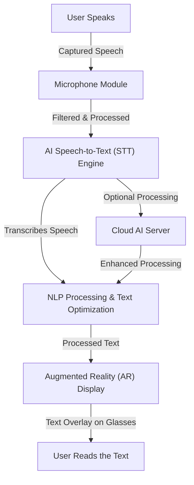
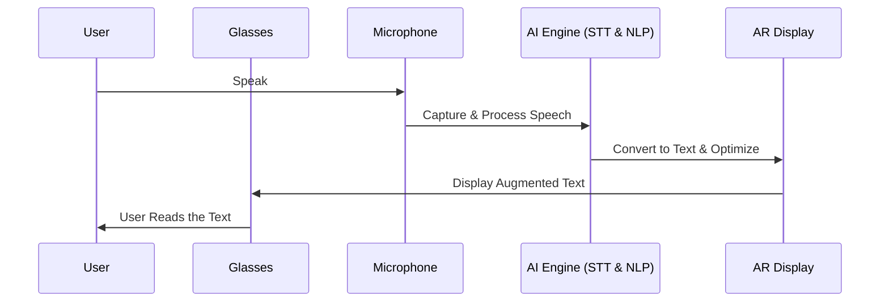
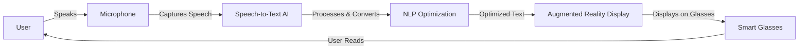
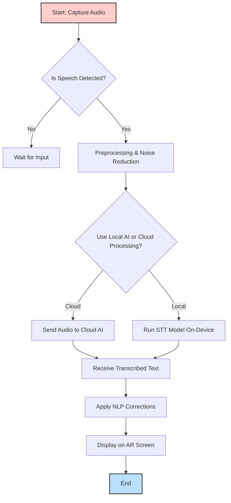

```mermaid
graph TD;
    A["User Speaks"] -->|Captured Speech| B["Microphone Module"];
    B -->|Filtered & Processed| C["AI Speech-to-Text (STT) Engine"];
    C -->|Transcribes Speech| D["NLP Processing & Text Optimization"];
    D -->|Processed Text| E["Augmented Reality (AR) Display"];
    E -->|Text Overlay on Glasses| F["User Reads the Text"];
    C -->|Optional Processing| G["Cloud AI Server"];
    G -->|Enhanced Processing| D;

    


```

```mermaid
sequenceDiagram;
    participant User
    participant Glasses
    participant Mic as Microphone
    participant AI as AI Engine (STT & NLP)
    participant AR as AR Display

    User->>Mic: Speak
    Mic->>AI: Capture & Process Speech
    AI->>AR: Convert to Text & Optimize
    AR->>Glasses: Display Augmented Text
    Glasses->>User: User Reads the Text
```

```mermaid
graph LR;
    User -->|Speaks| Microphone
    Microphone -->|Captures Speech| STT["Speech-to-Text AI"]
    STT -->|Processes & Converts| NLP["NLP Optimization"]
    NLP -->|Optimized Text| AR["Augmented Reality Display"]
    AR -->|Displays on Glasses| SmartGlasses["Smart Glasses"]
    SmartGlasses -->|User Reads| User
```

```mermaid
graph TD;
    A["Start: Capture Audio"] --> B{"Is Speech Detected?"};
    B -- "No" --> C["Wait for Input"];
    B -- "Yes" --> D["Preprocessing & Noise Reduction"];
    D --> E{"Use Local AI or Cloud Processing?"};
    E -- "Local" --> F["Run STT Model On-Device"];
    E -- "Cloud" --> G["Send Audio to Cloud AI"];
    G --> H["Receive Transcribed Text"];
    F --> H;
    H --> I["Apply NLP Corrections"];
    I --> J["Display on AR Screen"];
    J --> K["End"];

    style A fill:#ffcccc,stroke:#333,stroke-width:2px;
    style K fill:#bbddff,stroke:#333,stroke-width:2px;
```
