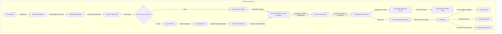

```mermaid
graph TD;

    %% ---- Hardware Layer ---- %%
    A1["User Speaks"] -->|Captured by| A2[" Microphone Module"];
    A2 -->|Audio Signal Processing| A3[" Embedded Processor"];

    %% ---- Software Layer ---- %%
    A3 -->|Send Processed Audio| B1["Speech Capture API"];
    B1 -->|Route Audio| B2{" Use Local AI or Cloud AI?"};

    %% ---- AI Speech-to-Text Processing ---- %%
    B2 -- "Local" --> C1["On-Device STT Model"];
    B2 -- "Cloud" --> C2["Cloud STT API"];

    %% Local STT Processing %%
    C1 -->|Transcribes Speech| D1["NLP Processing & Context Awareness"];

    %% Cloud STT Processing %%
    C2 -->|Sends Audio Data| D2["Cloud AI Server"];
    D2 -->|Speech Recognition Model| D3["Cloud AI STT Engine"];
    D3 -->|Returns Transcribed Text| D1;

    %% ---- NLP Processing ---- %%
    D1 -->|Grammar & Context Optimization| E1["NLP Processing API"];
    E1 -->|Apply Corrections & Formatting| E2["Text Optimization Service"];

    %% ---- AR Display & Output ---- %%
    E2 -->|Finalized Text Output| F1["AR Display Rendering Service"];
    F1 -->|Show on Glasses| F2["🕶️ Augmented Reality Glass"];

    %% ---- Storage & User Preferences ---- %%
    E2 -->|Store Data| G1["User Preferences Database"];
    G1 -->|Retrieve & Sync Settings| H1["Mobile App"];
    H1 -->|User Configures Settings| H2["User Interface"];

    %% ---- Authentication & Connectivity ---- %%
    H1 -->|Authenticate User| I1["Authentication API"];
    H1 -->|Connect to Smart Glasses| I2["Bluetooth/WiFi Service"];

    %% ---- Legend ---- %%
    subgraph Legend[System Components]
        A1
        A2
        A3
        B1
        B2
        C1
        C2
        D1
        D2
        D3
        E1
        E2
        F1
        F2
        G1
        H1
        H2
        I1
        I2
    end

   

```
