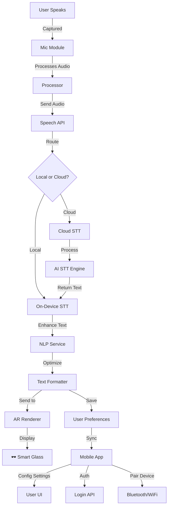

```mermaid
graph TD;

    %% ---- Hardware Layer ---- %%
    A["User Speaks"] -->|Captured| B["Mic Module"];
    B -->|Processes Audio| C["Processor"];

    %% ---- Software & AI Processing ---- %%
    C -->|Send Audio| D["Speech API"];
    D -->|Route| E{"Local or Cloud?"};

    %% Local STT %%
    E -- "Local" --> F["On-Device STT"];
    
    %% Cloud STT %%
    E -- "Cloud" --> G["Cloud STT"];
    G -->|Process| H["AI STT Engine"];
    H -->|Return Text| F;

    %% ---- NLP & Optimization ---- %%
    F -->|Enhance Text| I["NLP Service"];
    I -->|Optimize| J["Text Formatter"];

    %% ---- AR Display & Output ---- %%
    J -->|Send to| K["AR Renderer"];
    K -->|Display| L["🕶️ Smart Glass"];

    %% ---- Storage & Preferences ---- %%
    J -->|Save| M["User Preferences"];
    M -->|Sync| N["Mobile App"];
    N -->|Config Settings| O["User UI"];

    %% ---- Authentication & Connectivity ---- %%
    N -->|Auth| P["Login API"];
    N -->|Pair Device| Q["Bluetooth/WiFi"];

```

