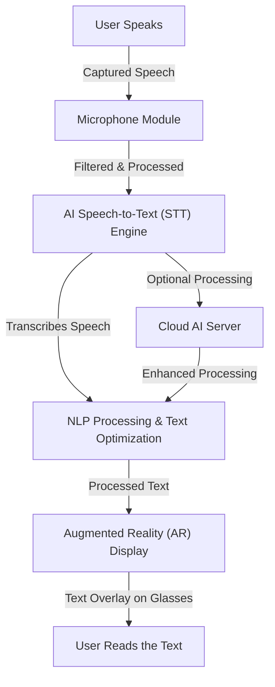
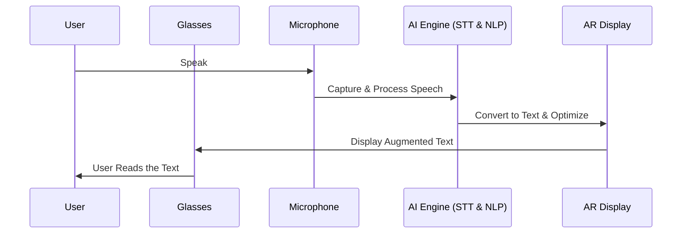

```mermaid
graph TD;
    A["User Speaks"] -->|Captured Speech| B["Microphone Module"];
    B -->|Filtered & Processed| C["AI Speech-to-Text (STT) Engine"];
    C -->|Transcribes Speech| D["NLP Processing & Text Optimization"];
    D -->|Processed Text| E["Augmented Reality (AR) Display"];
    E -->|Text Overlay on Glasses| F["User Reads the Text"];
    C -->|Optional Processing| G["Cloud AI Server"];
    G -->|Enhanced Processing| D;

    


```

```mermaid
sequenceDiagram;
    participant User
    participant Glasses
    participant Mic as Microphone
    participant AI as AI Engine (STT & NLP)
    participant AR as AR Display

    User->>Mic: Speak
    Mic->>AI: Capture & Process Speech
    AI->>AR: Convert to Text & Optimize
    AR->>Glasses: Display Augmented Text
    Glasses->>User: User Reads the Text
```
