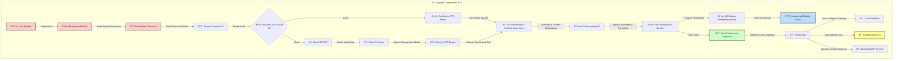

```mermaid
graph TD;

    %% ---- Hardware Layer ---- %%
    A1["ðŸŽ™ï¸ User Speaks"] -->|Captured by| A2["🎤 Microphone Module"];
    A2 -->|Audio Signal Processing| A3["📟 Embedded Processor"];

    %% ---- Software Layer ---- %%
    A3 -->|Send Processed Audio| B1["🎯 Speech Capture API"];
    B1 -->|Route Audio| B2{"🌠Use Local AI or Cloud AI?"};

    %% ---- AI Speech-to-Text Processing ---- %%
    B2 -- "Local" --> C1["ðŸ–¥ï¸ On-Device STT Model"];
    B2 -- "Cloud" --> C2["â˜ï¸ Cloud STT API"];

    %% Local STT Processing %%
    C1 -->|Transcribes Speech| D1["📠NLP Processing & Context Awareness"];

    %% Cloud STT Processing %%
    C2 -->|Sends Audio Data| D2["📡 Cloud AI Server"];
    D2 -->|Speech Recognition Model| D3["🧠 Cloud AI STT Engine"];
    D3 -->|Returns Transcribed Text| D1;

    %% ---- NLP Processing ---- %%
    D1 -->|Grammar & Context Optimization| E1["📜 NLP Processing API"];
    E1 -->|Apply Corrections & Formatting| E2["📌 Text Optimization Service"];

    %% ---- AR Display & Output ---- %%
    E2 -->|Finalized Text Output| F1["ðŸ–¥ï¸ AR Display Rendering Service"];
    F1 -->|Show on Glasses| F2["ðŸ•¶ï¸ Augmented Reality Glass"];

    %% ---- Storage & User Preferences ---- %%
    E2 -->|Store Data| G1["💾 User Preferences Database"];
    G1 -->|Retrieve & Sync Settings| H1["📲 Mobile App"];
    H1 -->|User Configures Settings| H2["ðŸ› ï¸ User Interface"];

    %% ---- Authentication & Connectivity ---- %%
    H1 -->|Authenticate User| I1["🔠Authentication API"];
    H1 -->|Connect to Smart Glasses| I2["📡 Bluetooth/WiFi Service"];

    %% ---- Legend ---- %%
    subgraph Legend[🔹 System Components 🔹]
        A1
        A2
        A3
        B1
        B2
        C1
        C2
        D1
        D2
        D3
        E1
        E2
        F1
        F2
        G1
        H1
        H2
        I1
        I2
    end

    %% ---- Styles for Clarity ---- %%
    style A1 fill:#ffcccc,stroke:#333,stroke-width:2px;
    style A2 fill:#ffcccc,stroke:#333,stroke-width:2px;
    style A3 fill:#ffcccc,stroke:#333,stroke-width:2px;
    style F2 fill:#bbddff,stroke:#333,stroke-width:2px;
    style G1 fill:#ccffcc,stroke:#333,stroke-width:2px;
    style I1 fill:#ffff99,stroke:#333,stroke-width:2px;

```
